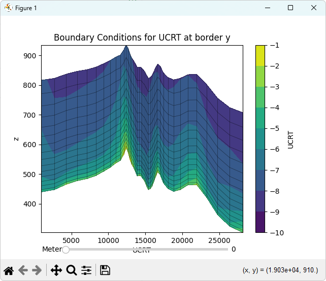
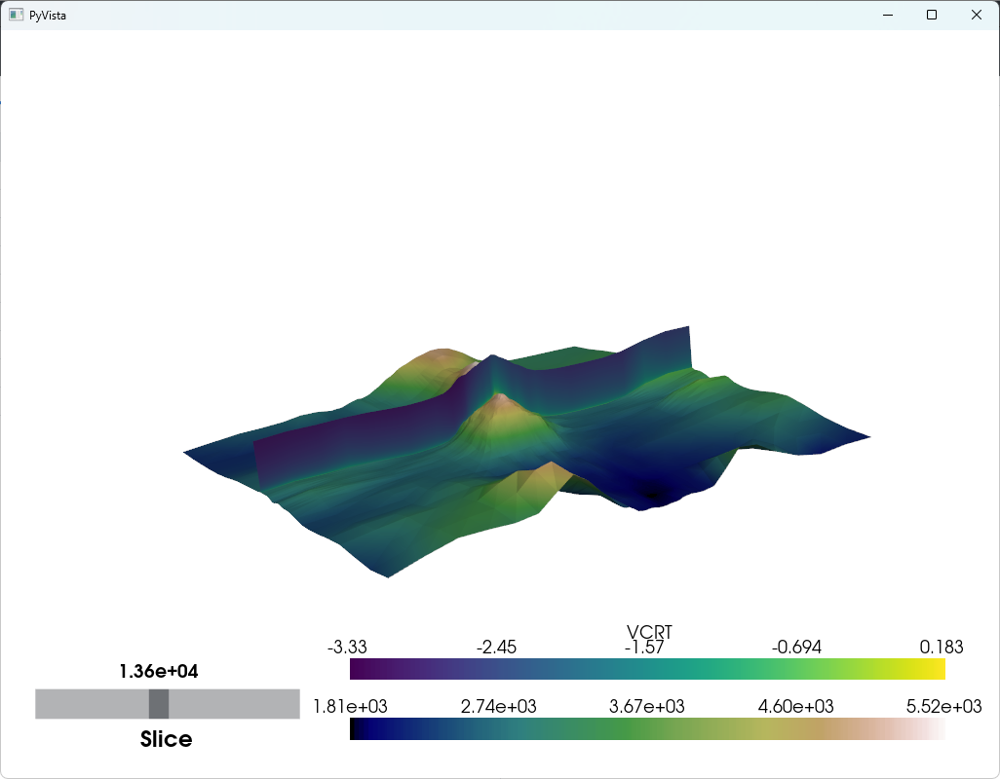
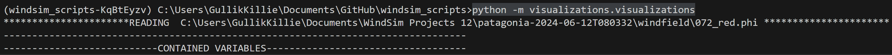

# Visualizations
The visualizations can show some of the content of the phoenics output, namely reading the phi (windfields) and the xyz file (grid point coordinates)

It serves as an example for how they can be interpreted.

The code in the visualizations/reader folder parses the files and stores them in a npz (numpy binary format), which is quick to access. This process can take a while for large projects, but then analyzing them afterward is quick.

## The 2D slicer:


## The 3D view:



## How to call the program
Open a terminal of your choice with a suitable python version installed, or an IDE.
Navigate to the windsim_scripts directory
```bash
pipenv shell # Install requirements locally from the Pipfile and enter a pipenv shell
python -m visualizations.visualizations
```
It should look like:


## Usage
Go into the visualizations/visualization.py file and select a project as the base parameter.
Then select the direction to analyze:

```python
 # Prepare and unzip
    base = Path('C:/Users/GullikKillie/Documents/WindSim Projects 12/patagonia-2024-06-12T080332/')
    project_path = base
    doc_folder = base  / 'my_documentation'
    sec_to_plot = '072_red'
```
This will look at the sector 072 and investigate the reduced files.

```python
    # Loading grid
    grid=Grid()
    grid.read(project_path / 'windfield' / f'{sec_to_plot}.xyz')
    grid.computeCellCenterCoord()
    grid.save(path = doc_folder / f'{sec_to_plot}.xyz.npz')
    grid_data = grid.load(path = doc_folder / f'{sec_to_plot}.xyz.npz')
```
This uses the xyz parser in readers and stores the binary file in 'project/my_documentation' 

```python
    # Loading phi file
    phi=Phi()
    phi.read(project_path / 'windfield' / f'{sec_to_plot}.phi')
    phi.save(path = doc_folder / f'{sec_to_plot}.phi.npz')
```
This uses the phi parser and stores the binary file.
```python
    # Variable to select
    # var = 'VCRT'
    var = 'UCRT'
    # var = 'KE  '
    # var= "TEM1"
    # var= 'P1  '

    slicer = Slicer(coord=doc_folder / f'{sec_to_plot}.xyz.npz', phi=doc_folder/ f'{sec_to_plot}.phi.npz', var=var)
    ani = animation.FuncAnimation(slicer.fig, slicer.update_plot, interval=1, save_count=500)
    plt.show()
```

This will look at the UCRT variable and display a slicer using the grid point position and the phi file output. 

```python
    slicer3D = Slicer3D(coord_path= doc_folder / f'{sec_to_plot}.xyz.npz', phi_path= doc_folder / f'{sec_to_plot}.phi.npz')
    plotter = slicer3D.initiate_plotter()
    plotter = slicer3D.elevation3D(plotter)
    # plotter = slicer3D.draggable_slice('TEM1', plotter)
    slicer3D._set_field_grid_variable('VCRT')
    slice = Slice(slicer3D.field_grid)
    print(slicer3D.field_grid.bounds)
    plotter.add_mesh(slice.output)
    plotter.add_slider_widget(
        callback=lambda value: slice('cell', int(value)),
        rng=[slicer3D.field_grid.bounds[0], slicer3D.field_grid.bounds[1]],
        value=30,
        title="Slice",
        pointa=(0.025, 0.1),
        pointb=(0.31, 0.1),
        style='modern',
    )

    plotter.show()
```

This will create a 3D viever with a vertical slicer.